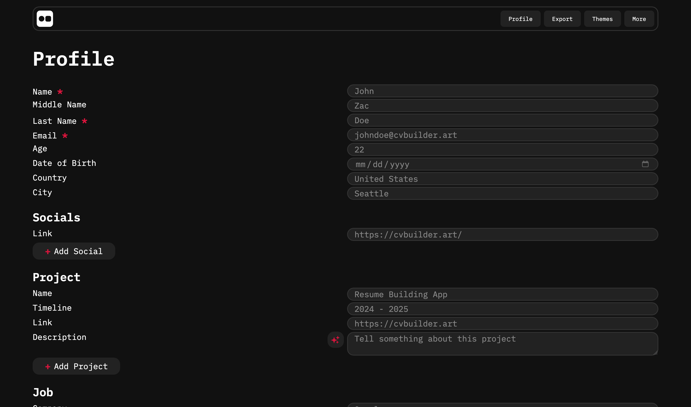

[](https://github.com/aqerd)
[](https://github.com/RasulGasanbekov)
[](https://github.com/tazik23)
[](https://github.com/aqerd/CVbuilder/subscription)
[](https://github.com/aqerd/CVbuilder)
[](https://github.com/aqerd/CVbuilder/issues)

#### Build your CV fast and easy way


## 🔗 How to start the project on your own
To start this you can clone our repository:
```shell
git clone https://github.com/aqerd/CVbuilder.git
```
Make sure you have Flask and Python installed on your machine

## 🔨 Powered by
- Python 
  - Pillow
  - Reportlab
  - Python-docx
  - Jinja2
- Flask
  - Flask-WTF 
  - Flask-Mail
- HTML 
  - CSS
  - JavaScript

## 🎨 Site design
Design was produced by Ruslan Suleymanov with Figma. See this project on [Behance](https://www.behance.net/gallery/215413437/CVbuilder) or in [Figma Community](https://www.figma.com/community/file/1465009107029457211/cv-builder).

## 🖼️ Contribute with new theme
Want to contribute our project with new theme design? See this [documentation](https://github.com/aqerd/CVbuilder/blob/main/docs/THEMES.md)

## 🚀 Usage
Site is not deployed yet

## 🧑‍💻 Credits
Project made by **Ruslan Suleymanov**, **Rasul Gasanbekov** and **Vladimir Golubev** for Python course at Ural Federal University 
