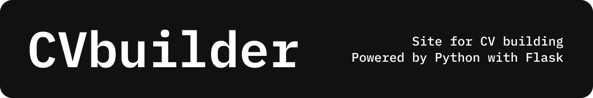

[](https://github.com/aqerd)
[](https://github.com/RasulGasanbekov)
[](https://github.com/tazik23)
[](https://github.com/aqerd/CVbuilder/issues)
[](https://github.com/aqerd/CVbuilder/subscription)
[](https://github.com/aqerd/CVbuilder)

### Build your CV fast and easy way


## 🔗 How to run
Make sure you have Flask, Python 3.10 (at least), and the [necessary libraries](https://github.com/aqerd/CVbuilder/blob/main/requirements.txt) installed on your machine.

To start this you can clone our repository:
```shell
git clone https://github.com/aqerd/CVbuilder.git
```
Set the environmental variables in `.env`. For reference see `.env.example`.
To get your GroqCloud API key, visit the [documentation](https://console.groq.com/docs/overview).

> [!NOTE]
> You can collect your email password by creating a new email on any SMTP Server and retrieving it from the settings.

Make sure you have Python 3.10 (at least), `make` (install it if you have Windows) and Docker installed on your machine. \
To build and up docker container run this:
```bash
make
```
Now go to `localhost:8181` in your browser.

> [!IMPORTANT]
> Note that you might encounter a connection error if you're running this in Russia.

## 🔨 Powered by
- Python
- uv
- Flask
- Docker
- HTML, CSS and JavaScript
- GroqCloud with Llama 3.3 70B Versatile

## 🎨 Site design
Designed by Ruslan Suleymanov in Figma. See this project on [Behance](https://www.behance.net/gallery/215413437/CVbuilder) or in [Figma Community](https://www.figma.com/community/file/1465009107029457211/cv-builder).

## 🖼️ Contribute with new theme
Want to contribute our project with new theme design? See this [documentation](https://github.com/aqerd/CVbuilder/blob/main/docs/THEMES.md)


## 🚀 Deployment
Site is not deployed yet

## 🧑‍💻 Credits
Project made by **Ruslan Suleymanov**, **Rasul Gasanbekov** and **Vladimir Golubev** for Python course at Ural Federal University 
